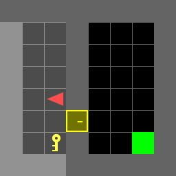
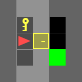
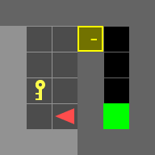
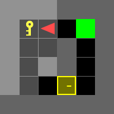
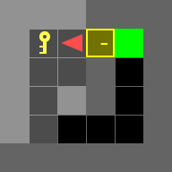
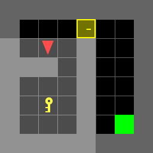
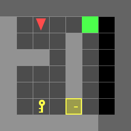
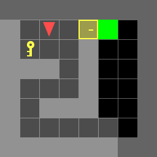

# Search based Path Planning

## Overview
In this project, we are going to implement dynamic programming to search the shortest path for the Door-Key problems. The objective of the agent is to get from start to goal with the least amount of the moves.

<p align="center">
</br>
</p>

There are 7 test scenes you have to test and include in the report.

| doorkey-5x5-normal |
|:----------------:|
|  |

| doorkey-6x6-normal   | doorkey-6x6-direct | doorkey-6x6-shortcut |
|:----------------:|:------------------:|:----------------:|
|  |  ||

| doorkey-8x8-normal   | doorkey-8x8-direct | doorkey-8x8-shortcut |
|:----------------:|:------------------:|:----------------:|
|  |  ||

## Installation

- Install [gym-minigrid](https://github.com/maximecb/gym-minigrid)
- Install dependencies
```bash
pip install -r requirements.txt
```

## Instruction
### 1. doorkey.py
**doorkey.py** the main entrance of the program.

### 2. utils.py
You might find some useful tools in utils.py
- **step()**: Move your agent
- **generate_random_env()**: Generate a random environment for debugging
- **load_env()**: Load the test environments
- **save_env()**: Save the environment for reproducing results
- **plot_env()**: For a quick visualization of your current env, including: agent, key, door, and the goal
- **draw_gif_from_seq()**: Draw and save a gif image from a given action sequence.

### 2. dp.py
- **get_next_state()**: Motion model x_t+1 = f(x, u)
- **step_cost()**: the cost of action
- **terminal_cost()**: cost when reaching the goal
- **DP()**: main dynamic programming, computing optimal policy